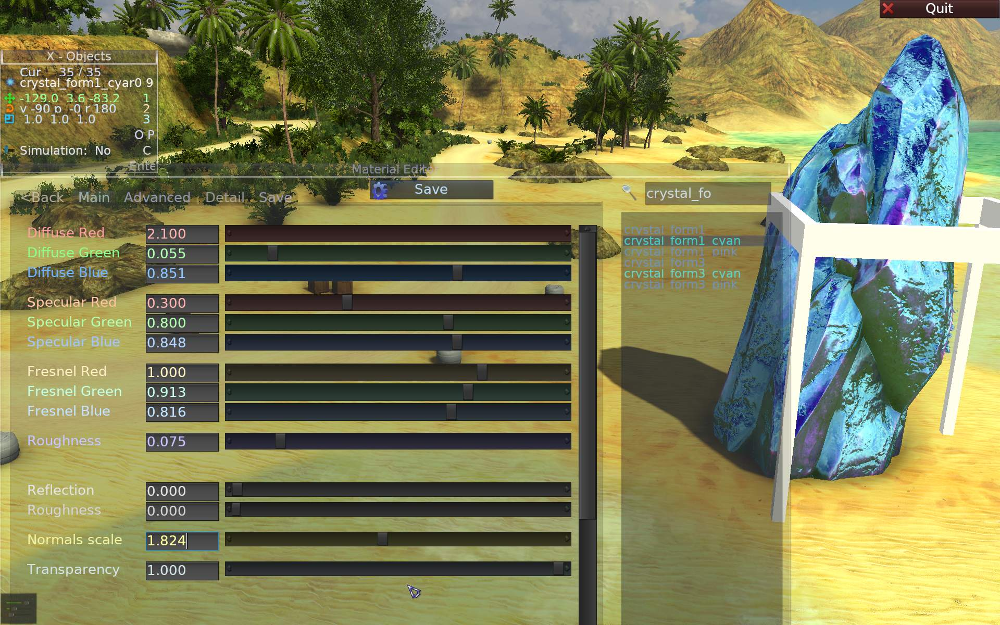
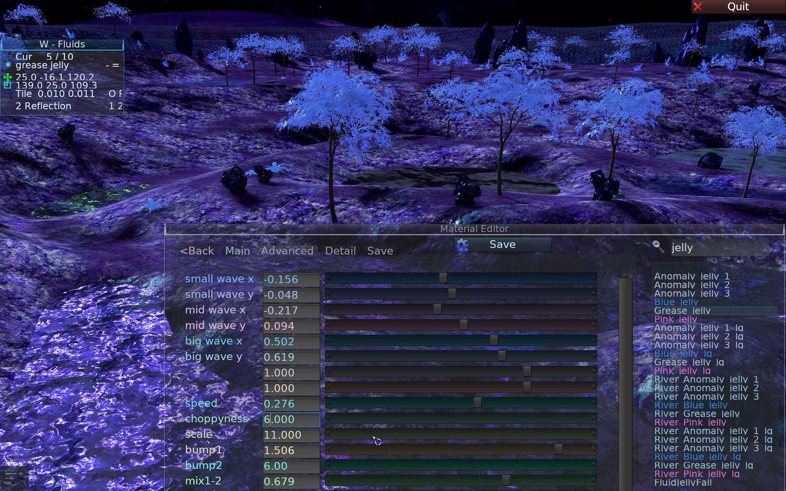
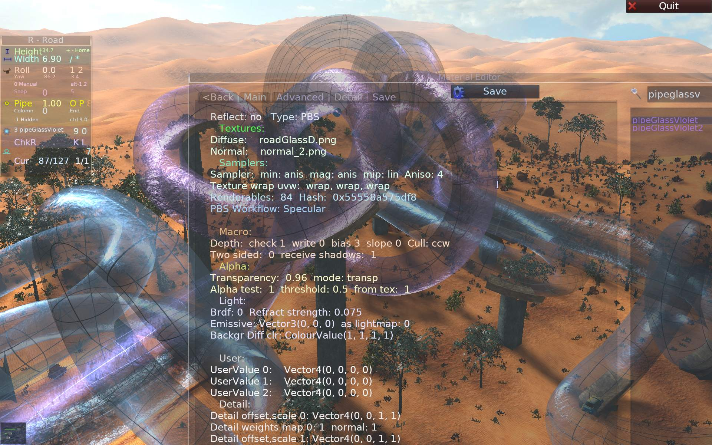

_Info on how to add new textures and materials for terrain, road, grass, objects, vehicles etc._

# General

## Introduction

This page explains what to do when adding new content.  
I.e. where to put your new data and which files need to be edited so it can appear and look good in SR3.


### 📄 Presets

The file [config/presets.xml](../config/presets.xml) is used by editor and game.  
It is edited manually (in original install folder).  
Nothing new will appear in editor's pick lists, unless you add a line for it in that file.  
It is quite simple, just copy a similar line and add it (keep it alphabetically sorted and spaces aligned).  
Change the 2nd param (or 1st for skies) to your new resource name.

See comments inside presets.xml `inside <!-- -->` for (short) info on each parameter.  
Later you can (and should) setup other values for parameters, e.g. layer scaling or model size etc,  
that are set (by default) when picking in editor (less manual setup needed).  
The `r - rating` param is subjective and high values are meant for best, most popular resources used.  
If you add a unique thing, just used on a couple of tracks, rate it low, unless it's meant to be used more.


### 🔮 Materials

**All materials** are now in [here](../data/materials/Pbs/) in `*.material.json` files.  
Only ones not using lights, or Pbs, are called unlit. Those are particles and Hud.  
More info on this `.json` format at bottom.

### 📝 Text

There are files `_*.txt` in each key data subdir, with info for:  
- original data name, author, **license**, date, url etc.  

These are all gathered and listed on Help - **Credits** tab in game.  
These files need to be edited every time we add something new.  
Whether it's your creation or others, we should note it in there, even for CC0.


## ⛅ Skies

Sky textures are in [data/textures/skies](../data/textures/skies). More info in [_skies.txt](../data/textures/skies/_skies.txt).  
Those are 360x90 degree spherical textures. One texture for whole skydome, 8k x 2k (1k is 1024).  
Material names start with `sky/` in `sky.material.json`. To add new, just copy last and replace "emissive" texture for yours.

## ✨ Particles

Need to convert to Pbs, make them lit, add soft particles, etc.  
There are limits to rendering: [video particle](https://www.youtube.com/watch?v=RvftnHZbKJo&list=PLU7SCFz6w40OJsw3ci6Hbwz2mqL2mqC6c&index=17),  
and [post](https://forums.ogre3d.org/viewtopic.php?p=556891#p556891) with possible fixes (mostly using Alpha Hashing + A2C) from latest ogre-next 4.0 master.

## ⛰️ Terrain

Textures for terrain layers are in [data/textures/terrain](../data/textures/terrain). More info in [_terrain.txt](../data/textures/terrain/_terrain.txt).  
They are all .jpg saved at about 97%. Size is square 1k (1024) or 2k.

Name endings mean:  
_d - diffuse texture (main)  
_s - specular amount (not color)   if not present, will be black (no specular)  
_n - normal map (needed, if not provided can be made with some tool)  
_You can use flat_n.png before real normalmap for quicker test._  
*_h - old not used now, was for broken parallax height*

Unlike other things, terrain has its own material and shader, so only adding to presets.xml is needed.


## 🛣️ Road etc

**Road** textures are in [data/textures/road](../data/textures/road) with also some general for water etc.  
Some info in [_road2.txt](../data/textures/road/_road2.txt) and [_road1.txt](../data/textures/road/_road1.txt). _ToDo: rest, need more.._

When adding a new road material in [road.material.json](../data/materials/Pbs/road.material.json),  
you need to add two materials e.g. `roadJungle_ter` and `roadJungle`.  
The one with `_ter` is for road **on terrain**, it has more bumps, and alpha border/texture.  
The other (without `_ter`) is for **bridged** roads and is more flat, it can use own textures.

**Other** materials include: road wall, pipe, pipe glass, pipe wall, column, and universal.  
These are in [wall.material.json](../data/materials/Pbs/wall.material.json),
A good list for orientation is in `presets.xml` and same in editor.

**Pipe glass** materials are twice in [pipe.material.json](../data/materials/Pbs/pipe.material.json) e.g. `pipeGlass` and `pipeGlass2`.  
So 2nd has `2` added at end and only difference is in Macroblock, `cull_mode`.  
This 2nd is auto cloned by SR3 code, but since we save(d) all materials at once, they're just in `.json` too.

**Rivers** have a similar situation, a `River_` material is basically a copy of a `Water_` material.  
With `"reflect": true` added and speed is higher (it's in `detail_diffuse3` - `offset` 1st value).  
Since we can't inherit in `.json`, we'd need to copy each new fluid material into a river material, change name and speed etc.


## 🌿 Grass

Grass textures are in [data/textures/grass](../data/textures/grass).  
These are transparent .png and mostly 512x512.  
Flowers, seaweeds and all else posing as grass are also there.  
Materials are simple and in [grass.material.json](../data/materials/Pbs/grass.material.json).  


## 🌳🪨 Vegetation

Models (meshes and their textures) are in `data/models/trees*`.  
The `trees-old` should to be replaced eventually with better.  
Rocks, caves, crystals etc are in `data/models/rocks` and `data/models/rockshex`.  
More info in their `_*.txt` files.


## 📦🏢 Objects

Objects have their own [Objects page](Objects.md) for meshes, exporting etc.  
Meshes, textures etc are in `data/models/`, subdirs:  
- `objects` - for dynamic objects with `.bullet` files and their 2nd `*_static.mesh` if needed (just a copy of `.mesh`).  
- `objects0` - for 0.A.D. models (mainly buildings) only, converted (from .dae).  
- `objects2` - for static objects with just `.mesh` and textures.
- `objectsC` - for new City buildings, Alien etc. Also has various, universal `metal*` textures.
- `obstacles` - recently split, only for obstacles.
- `gems` - recent collectible item(s) and win cups.

Each subdir has a `_*.txt` file with info on all from this folder. Any new model added needs also a new entry there in `_*.txt`.  
This is important for Credits in game, for credits to authors (if CC-BY, CC-BY-SA, but CC0 too) and tracking licenses, models, urls, etc.  

More info on materials for objects, in next chapter here.


----

# 🔮 Materials

## 📜 Old

Oldest SR 2.x `.mat` format and temporary SR 3.x `.material` are history.  
Not to be used.  
For clarity, info about them got split into other page: [MaterialsOld](MaterialsOld.md), mainly for comparison.  

It has some info about parameters like 🪨roughness, 🪞fresnel, xml for 🏔️terrain layers, etc.


## 🎨 Material Editor

Editing any `.material.json` files by hand is a slow way, as it needs restart to check results,  
but you already have needed changes in those files.  
The better way is using our **Material Editor**,  
saving and then applying / merging changes back to original files  
(can be done with a [diff tool](https://en.wikipedia.org/wiki/Comparison_of_file_comparison_tools)).  

Materials can be adjusted real-time in Material Editor.  
To show it press Alt-F. Or from Options, button on tab Tweak.  
Use **<Back** tab to return to regular Gui windows, or a shortcut like Alt-Q etc.

This is a separate, quite transparent window with many sliders to tweak parameters, like:
- Diffuse, Specular (✨shine) colors,
- Fresnel (🪞reflection) colors,
- another Reflection (clear coat, mostly for vehicle paint),
- 🪨Roughness, Normals scale, etc.

You can **search** materials by name, typing text in right top 🔍editbox.  
There are few tabs, water has own set.  



The Advanced tab is for **fluid** parameters, meant to tweak and edit here, not in file.




Last tab has more Details as text. _Maybe some could be changable in future._  
E.g. for textures, samplers (wrap etc.), depth check, cull mode,  
and for some: transparency (glass), refraction (fluids), etc.




----

## 🌠 New .material.json

We now use `.material.json` format (for almost all materials). It is more advanced, but longer.  
A bit worse to edit by hand. There are no comments in this .json, sadly.  
Its syntax is explaned with examples below.

Material Editor GUI can **save** into `.json` files in (Windows [Paths](Paths.md)):  
`/home/user/.cache/stuntrally3/materials`  
either one material or all.  

### Duplicated

In `.material.json` you **can't inherit** materials (confirmed [here](https://forums.ogre3d.org/viewtopic.php?p=553712#p553712)).  
Need to **duplicate** them whole for:  
- rivers in [fluid_river](../data/materials/Pbs/fluid_river.material.json) (in addition to [fluid](../data/materials/Pbs/fluid.material.json) - with Refraction)
- low quality - (no Refraction) `_lq`, both: [fluid_lq](../data/materials/Pbs/fluid_lq.material.json) and [fluid_river_lq](../data/materials/Pbs/fluid_river_lq.material.json)
- [pipe glass](../data/materials/Pbs/pipe.material.json), in same file, next material right after, its name has `2` at end  
only difference is other cull in `"macroblock" : "Macroblock_15"` or `"Macroblock_17"`
- [vehicles](../data/materials/Pbs/vehicle.material.json) painted body (has `"paint" : true,`), in same file, exact copies (**7** times, 6 players + 1 ghost):  
e.g. for car SX: SX_0, SX_1,.., SX_5, SX_G. And only ES_T has extra 1 for Track's ghost.

It **is** annoying, tedious😩, longer, and almost all are same copy.  
But duplicating datablocks from cpp code caused [weird bug](https://www.youtube.com/watch?v=pT-X4CGyDX4&list=PLU7SCFz6w40OJsw3ci6Hbwz2mqL2mqC6c&index=13) and [another](https://www.youtube.com/watch?v=e9PMS1H0L0I&list=PLU7SCFz6w40OJsw3ci6Hbwz2mqL2mqC6c&index=11).


### Syntax

Also important is to not break **.json syntax**. E.g. don't leave a comma `,` before `}`.  
It also needs more symbols like `: " [ ] { }` to work.  
I highly recommend using an IDE that does check syntax  
and underlines in red right when a syntax error happens during editing.  
I use [VSCodium](https://github.com/VSCodium/vscodium), but possibly smaller editors could too.  


### Top blocks

Top section of (each) `.material.json` has now: samplers, macroblocks and blendblocks.  
This is a detail on Ogre-Next implementation for more performance on rendering (in-depth info [here](https://ogrecave.github.io/ogre-next/api/latest/hlms.html)).  

Shortly put, many parameters (like e.g. cull (e.g. leaves), depth_write (e.g. glass), texture wrap/clamp etc.)  
have been grouped to blocks and these are reused. Not all parameters set for each material like before.  
In old SR `.mat` we had everything possible to use, easy to set, and short. Now it's more complex and long.  

For example, if you're making a new material (for pipe glass, tree leaves, grass, etc),  
then check other similar material and copy its top section, like:
```
			"macroblock" : "Macroblock_0",
			"blendblock" : "Blendblock_0",
```
to your material. It should render properly then.

**Quick examples**, with (almost) full syntax, in [_Example.material.json-](../data/materials/Pbs/_Example.material.json-). 
With also links on top.

----

# 📃 Examples

These sections below can also be used as starting themplate for your material(s).  
Few frist chapters below have special cases.  
These materials can be applied to objects, roads, vehicles, etc.  
Not particles yet. Terrain layers won't be there.  


## 💧 Fluids

Fluids like `Water_*`, etc and `River_*` aren't meant to be edited by hand in `.json`.  
Parameters stored there don't have names, hard to say which value does what (code is in `HlmsPbsDb2::HlmsPbsDb2`).  
Simply use Material Editor Gui to tweak them.  
Save single material .json (or all).

Then *manually* merge with `fluid.material.json`.  
You could overwrite whole 'pbs' section, leaving top blocks.
But have to replace samplers etc to our.  
For testing you can save in Material Editor and put new files with all json.
But names can't duplicate.

## ⛅ Skies

Quite easy, yet a lot of lines.  
The only thing that matters is emissive texture. Rest is the same.  


```
		"sky/light_blue" :
		{
			"macroblock" : "Macroblock_0",
			"blendblock" : "Blendblock_0",
			"shadow_const_bias" : 0.01,
			"workflow" : "specular_ogre",
			"diffuse" :
			{
				"value" : [0, 0, 0],
				"background" : [1, 1, 1, 1]
			},
			"specular" :
			{
				"value" : [0, 0, 0]
			},
			"fresnel" :
			{
				"value" : [0.01, 0.01, 0.01],
				"mode" : "coloured"
			},
			"roughness" :
			{
				"value" : 0.01
			},
			"emissive" :
			{
				"value" : [1, 1, 1],
				"texture" : "sky_lightblue.jpg",
				"sampler" : "Sampler_Sky"
			}
		},
```
----


## Example 1 basic

Very basic. Only **diffuse** texture `balloon2cl.png` .

```
		"balloon2cl" :
		{
			"macroblock" : "Macroblock_0",
			"blendblock" : "Blendblock_0",
			"shadow_const_bias" : 0.01,
			"workflow" : "specular_ogre",
			"diffuse" :
			{
				"value" : [0.9, 0.9, 0.9],
				"background" : [1, 1, 1, 1],
				"texture" : "balloon2cl.png",
				"sampler" : "Sampler_10"
			},
			"specular" :
			{
				"value" : [0.2, 0.2, 0.2]
			},
			"fresnel" :
			{
				"value" : 0.1,
				"mode" : "coeff"
			},
			"roughness" :
			{
				"value" : 0.6
			}
		},
```


## Example 2

**Diffuse and normal** textures.

```
		"ptol_struct" :
		{
			"macroblock" : "Macroblock_0",
			"blendblock" : "Blendblock_0",
			"shadow_const_bias" : 0.01,
			"workflow" : "specular_ogre",
			"diffuse" :
			{
				"value" : [0.744, 0.744, 0.744],
				"background" : [1, 1, 1, 1],
				"texture" : "ptol_struct.jpg",
				"sampler" : "Sampler_10"
			},
			"specular" :
			{
				"value" : [0.2, 0.2, 0.2]
			},
			"fresnel" :
			{
				"value" : 0.1,
				"mode" : "coeff"
			},
			"normal" :
			{
				"value" : 1,
				"texture" : "ptol_struct_norm.jpg",
				"sampler" : "Sampler_10"
			},
			"roughness" :
			{
				"value" : 0.6
			}
		},
```


## Example 3, common

With 3 textures:
- diffuse
- normalmap (with `_norm` or `_n` at end)
- specular (`_spec` or `_s` at end)

Here also bump_scale is set as 0.6 under "normal", "value".  
fresnel - is as 1 value coeff (not 3)  
roughness - as 1 value

```
		"hexrock_grey" :
		{
			"macroblock" : "Macroblock_0",
			"blendblock" : "Blendblock_0",
			"shadow_const_bias" : 0.01,
			"workflow" : "specular_ogre",
			"diffuse" :
			{
				"value" : [0.8, 0.8, 0.8],
				"background" : [1, 1, 1, 1],
				"texture" : "hexrock_grey.jpg",
				"sampler" : "Sampler_10"
			},
			"specular" :
			{
				"value" : [0.4, 0.3, 0.35],
				"texture" : "hexrock_spec.jpg",
				"sampler" : "Sampler_10"
			},
			"fresnel" :
			{
				"value" : 0.1,
				"mode" : "coeff"
			},
			"normal" :
			{
				"value" : 0.6,
				"texture" : "hexrock_norm.jpg",
				"sampler" : "Sampler_10"
			},
			"roughness" :
			{
				"value" : 0.5
			}
		},
```


## Example 4, reflect

Also with **reflection** as `"reflect" : true,` for metal / glossy look.  
Here `fresnel` is `coloured` and has 3 values.  
It is the reflection color (and amount) for dynamic environment cube reflection.

```
		"hexrock_metal" :
		{
			"macroblock" : "Macroblock_0",
			"blendblock" : "Blendblock_0",
			"shadow_const_bias" : 0.01,
			"reflect" : true,
			"workflow" : "specular_ogre",
			"diffuse" :
			{
				"value" : [0.8, 0.8, 0.8],
				"background" : [1, 1, 1, 1],
				"texture" : "hexrock_metal.jpg",
				"sampler" : "Sampler_10"
			},
			"specular" :
			{
				"value" : [0.3, 0.35, 0.35],
				"texture" : "hexrock_metal_spec.jpg",
				"sampler" : "Sampler_10"
			},
			"fresnel" :
			{
				"value" : [0.3, 0.37, 0.4],
				"mode" : "coloured"
			},
			"normal" :
			{
				"value" : 1,
				"texture" : "hexrock_metal_norm.jpg",
				"sampler" : "Sampler_10"
			},
			"roughness" :
			{
				"value" : 0.3
			}
		},
```


## Example 5, roughness map

**Advanced** PBS, with reflect and also `roughness` map.  
Intensity on roughness map texture (black-white) give unique per texel roughness, applied same as other textures.  
The `"value" : 0.3` under `roughness` does scale texture values 0 to 1 now as 0 to 0.3.  

```
		"garbage_bin_blue" :
		{
			"macroblock" : "Macroblock_0",
			"blendblock" : "Blendblock_0",
			"reflect" : true,
			"shadow_const_bias" : 0.01,
			"workflow" : "specular_ogre",
			"diffuse" :
			{
				"value" : [1, 1, 1],
				"background" : [1, 1, 1, 1],
				"texture" : "garbage_bin_blue.jpg",
				"sampler" : "Sampler_10"
			},
			"specular" :
			{
				"value" : [0.6, 0.6, 0.6],
				"texture" : "garbage_bin_green_spec.jpg",
				"sampler" : "Sampler_10"
			},
			"fresnel" :
			{
				"value" : [1, 1, 1],
				"mode" : "coloured"
			},
			"normal" :
			{
				"value" : 1,
				"texture" : "garbage_bin_norm.jpg",
				"sampler" : "Sampler_10"
			},
			"roughness" :
			{
				"value" : 0.3,
				"texture" : "garbage_bin_rough.jpg",
				"sampler" : "Sampler_10"
			}
		},
```

Here all **possible textures** are present:  
diffuse, specular, normal, roughness.  

- diffuse - is base non metal color, shouldn't have shadows  
  and colors shouldn't be too dark or too bright, more in sRGB scale.
- normal - normalized perpendicular vector, scaled to 0..1 from -1..1.
- specular - tells where surface will shine from light reflection.
- 🪨roughness - tells how much it will shine: 0 is mirror, 0.2 most shine, 0.4 gets blurry, 0.9 is just dull.

There is no *metalness* texture, it's meant for a simpler *metallic* workflow,  
we use *specular_ogre* workflow which has own colors (on texture) for specular shine.


## Example 6, detail maps

Extra textures (layers) can be added to modulate original diffuse and/or normal textures.

```
		"obstaclesGrey" :
		{
			"macroblock" : "Macroblock_0",
			"blendblock" : "Blendblock_0",
			"shadow_const_bias" : 0.01,
			"workflow" : "specular_ogre",
			"diffuse" :
			{
				"value" : [0.8, 0.8, 0.8],
				"background" : [1, 1, 1, 1],
				"texture" : "obstaclesGrey_d.jpg",
				"sampler" : "Sampler_10"
			},
			"specular" :
			{
				"value" : [1, 1, 1],
				"texture" : "obstaclesGrey_s.jpg",
				"sampler" : "Sampler_10"
			},
			"fresnel" :
			{
				"value" : [0.6, 0.6, 0.6],
				"mode" : "coloured"
			},
			"normal" :
			{
				"value" : 1,
				"texture" : "obstaclesGrey_n.jpg",
				"sampler" : "Sampler_10"
			},
			"roughness" :
			{
				"value" : 0.7,
				"texture" : "obstaclesGrey_n.jpg"
			},
			"detail_diffuse0" :
			{
				"mode" : "Multiply",
				"scale" : [12, 12],
				"value" : 0.8,
				"texture" : "metal_212_wh.jpg",
				"sampler" : "Sampler_10"
			},
			"detail_normal0" :
			{
				"mode" : "Multiply",
				"scale" : [12, 12],
				"value" : 0.9,
				"texture" : "metal_212_norm.jpg",
				"sampler" : "Sampler_10"
			}
},
```

In this quite advanced material, 2 extra maps are added.  
First `detail_diffuse0` map multiplying regular `diffuse` map.  
Other `mode` variants are possible, all inside `@piece` in [this shader file](../data/Hlms/Pbs/Any/Main/200.BlendModes_piece_ps.any).  
The `scale` is UV coords multiplier, it means that detail map will repeat 12 times more.  
There is also `offset` which just gets added to UV coords.

Great for adding smaller scale detail like scratches, etc.  
Mostly detail_diffuse0 should be white though to not change regular color.

Another map is `detail_normal0` to modulate `normal` map.  
The `value` is a multiplier for how much.

Note that `detail_diffuse0` and `detail_normal0` aren't required both, only diffuse or normal is okay too.  
Also value, scale and offset can have other values set. And detail_normal0 value can be negative for opposite effect.

There can be more detail maps (4 total, 0..3). But let's not over do this, it affects Fps (performance).


_ToDo:_ we could even do material animations this way,  
by adding e.g. `sin(atmo.globalTime.x)` in some `@piece` cases..
