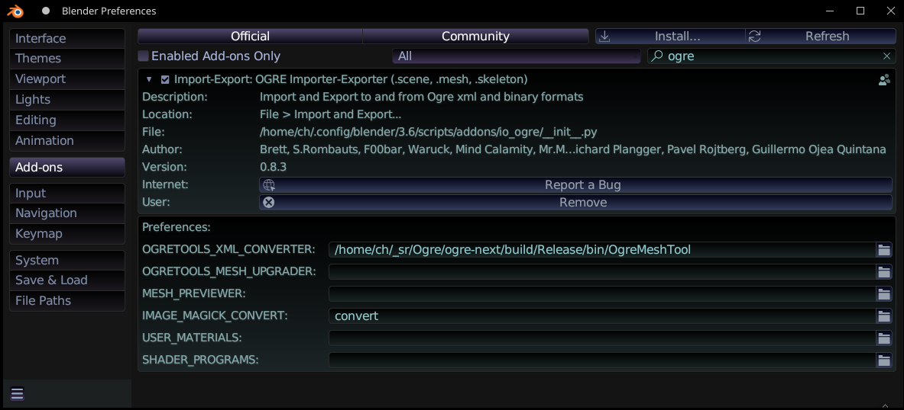
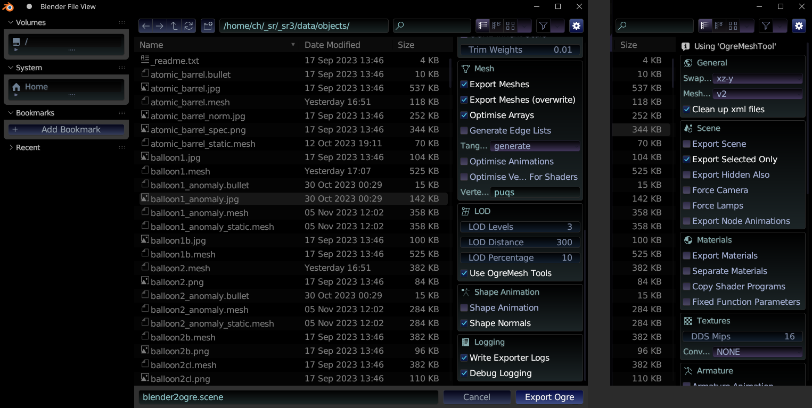

_Adding static or dynamic objects into SR3, using Blender and exporting._


## Adding

To add a model / object you can either **Create** it in [**Blender**](https://www.blender.org/), or:

### Use CC objects

Download from one of the model web portals like: [sketchfab](https://sketchfab.com/search?category=nature-plants&features=downloadable&licenses=7c23a1ba438d4306920229c12afcb5f9&licenses=b9ddc40b93e34cdca1fc152f39b9f375&licenses=322a749bcfa841b29dff1e8a1bb74b0b&sort_by=-viewCount&type=models), [blendswap](https://www.blendswap.com/categories), [polyhaven](https://polyhaven.com/models/nature) or [opengameart](https://opengameart.org/).

<u>**NOTE 1:**</u> License **must** be: CC0, CC-BY, CC-BY-SA, only (info e.g. [here](https://en.wikipedia.org/wiki/Creative_Commons_license)).  
If not specified, don't bother. _E.g. there is a lot of stuff only for use in Unity, UE or such nonsense, or "free download" crap)._  

**Note 2:** Also needs a "sanity test", to check for proper human **Artist(s)**.  
_There are now many trolls, kids, bots, idiots copying other's or illegally got stuff and putting on Sketchfab, and they don't check it._  
Usually if you see a name, registered few years ago, with some link to Artist's other website too, then it's good.  

**Note 3:** Also, check description, because sometimes e.g. used textures aren't licensed properly and need to be replaced, etc.

Many models there are too high poly (high faces/triangles count) and meant for movies or rendering, not for games.

## Steps

This here is a short list before contributing.

  - Once seen the model is ok, and can be useful:
    * create a folder with a **good_name** (but_not_too_long)  
      to have some consistency, when picking model in editor, etc.
    * convert .tga to **.png**, .obj (or other) to .blend
    * use **.jpg** textures to save size (e.g. 90-95% quality), unless transparent / alpha needed
    * check textures, possibly **resize**: for small objects 1k is ok, 2k for bigger,  
      _and 4k is only okay for very big objects, or detailed road, terrrain (future high quality)._
    * add **readme.txt** - a must, with original: model name, Author, License, url
    * (old) possibly attach preview.jpg - so people may be interested in working with the model further
    * make a fork, then PR, to upload to [blendfiles](https://github.com/stuntrally/blendfiles) repo
  - Export from Blender to Ogre .mesh, check the look in game
    * remember to use real life **scale** - meters
    * **compare** size to a car (start pos), e.g don't do real buildings that are *bigger* than a human would use
    * reset all transforms (Ctrl A) before exports
  - **Dynamic** objects need `.bullet` file
    * watch this: [video](http://www.youtube.com/watch?v=fv-Oq5oe8Nw) and add that to logic,  
      then pressing P twice should start physics and export `.bullet` file
    * add simple physics shape(s), make actor (rigid body)
    * on Material tab under Physics set friction
    * on Physics tab set mass, damping (linear and angular, check in game)
    * don't forget to set the Margin to e.g. 0.1 under collision bounds
    * for static models: if too high poly - create 1 simpler mesh for collision (we never did it yet)  
      if low poly - (like 0AD building) do nothing, will have trimesh made in code
  - Done (be happy, suggest adding it to some tracks, or make a new with it, use other too)

----

## Creating

This section walks you through the steps to create new static object and add it to Stunt Rally.

_Warning_: The learning curve for Blender is quite steep, you need to invest a serious amount of time to learn and use it efficiently.  
Fortunately there are plenty of tutorials, videos, websites and books to pick up the skills. 

Currently static and dynamic objects are stored in the `/data/objects` and similar folders.  
It contains Ogre mesh files (binary), surface images (textures) and .bullet files for dynamic objects.

   
## Tutorial 1

### Requirements

Blender, [Downloads here](https://www.blender.org/download/get-blender/).

### Export plugin

Blender comes with plenty of import and export plugins, but the Ogre export plugin we need to download separately.  

Ogre-Next 3.0 for now has no SDK, so SR 3.0 RC3 has a file `ogre-mesh-v2.7z` [link](https://github.com/stuntrally/stuntrally3/releases/tag/3.0-rc3).  
So firstly unpack `ogre-mesh-v2.7z` somewhere.

Download the latest **blender2ogre** plugin [from here](https://github.com/OGRECave/blender2ogre/releases)
and follow [installing](https://github.com/OGRECave/blender2ogre#installing) guide.

I.e. extract `io_ogre` to addons, then enable it in Blender, and configure to use:
- on Windows that `OgreMeshTool.exe` from our `ogre-mesh-v2.7z`
- on Linux `OgreMeshTool` binary, if built yourself in `/Ogre/ogre-next/build/Release/bin/`

Screen with installed and configured plugin in Blender options (on Linux):



After all that you can export from Blender menu directly Ogre `.mesh` files for use in SR3 now.


### Old v1 mesh

Other option is to export old way (like for SR 2.x) .mesh v1. And then convert it to v2 .mesh. Like so:  
`OgreMeshTool -v2 -e -t -ts 4 -O puqs -l 2 -d 200 -p 10 something.mesh`  
This is also for converting any objects from old SR 2.x.

### LODs

More arguments examples passed as arguments to `OgreMeshTool`  
(for -l LODs count, -d distances, -p % reduce, tangents and other options)  
are in [ogre-mesh.py](../config/ogre-mesh.py) Python script.  

For many meshes you can just run this script, it does convert all files in 1 folder (set inside).

We use LODs now, which are crucial for vegetation.  
They need some time to test. For high poly surely:  
3 LOD levels, distance 200 or so and LOD % reduce 10 (or more if ok).

It needs to be tweaked, so that there are no holes (missing tris)  
as viewed in SR3, when you lower to 0 - in Graphics - Detail - first slider (Objects, Vegetation) - aka *the LOD bias*.

----

## Create a simple static object

For testing purpose we just export a Blender default object (the box, or maybe the monkey)


## Export

To export, select mesh in Blender and use from menu: File - Export - Ogre3D.

It is **crucial** to have `xz-y` set and `generate tangents` in *Blender Ogre export* dialog.  
Most likely also LODs values, best if tested in SR3.  

Rest can be seen on screen (right side has options twice because it scrolls down):  



File name here isn't needed, `.mesh` file will be named like mesh(es) in Blender.

It can take few seconds. If succesfull, you will find .mesh file(s) in the selected folder  

**Copy the binary** `.mesh` into the `objects/` or similar folder in SR3 `data/`.

Start **SR Editor** and place the object.


Works! Now we have the object on our track.  
Not much interaction, other than you can collide with the object, but it will not move.  
That's why we continue to create a dynamic object, by creating a binary `.bullet` file containing all necessary physical information.


## Create a dynamic object

Blender can export the dynamics of an object (to be more exact of the whole world in your Blender project) to binary file.  
This part of the tutorial will walk through the necessary steps.

Start Blender, we can continue with the previous test object.
Change to the Game Mode


Open the Blender text editor


and enter this code:
```
import PhysicsConstraints;
PhysicsConstraints.exportBulletFile("object.bullet")
```
Save it as `bulletexp`


You cannot execute the script from here, we need to do this via the running game engine.   Open a logic editor window  


Select the cube object in the 3D view. Add a sensor for keyboard input ("p" key) and connect it to a controller to execute our script from above


Open the physics attributes for our object and do the following settings   Physics Type: dynamic   Actor   Collision bounds box


Click into the 3D window and start the engine by pressing "p"   For a short moment you will see the object falling down.   Press "p" again (for our keyboard sensor).

The script creates an `object.bullet` file in the blender folder


Copy the file to the same object folder as our meshfile, it must have the same filename as the mesh file (eg. `object.mesh` and `object.bullet`)

Start the SR editor, place the object. Press "C" to simulate physics, if OK check out your track.

### Remarks on objects
Keep it low poly and use only 1 material if possible.  
I depends on how many times an object will be on track.

Example, triangle counts for various objects:
| triangles | object type |
|-----|------|
| 300 | small rock |
| 600 | fern, plant |
| 1k | small tree, rock, barrel etc |
| 3k | big tree (less on track) |
| 10k | static object, eg. temple, that won't be many times |
| 50k | a detailed object, meant to be once on a track   (eg. inside of pyramid, or spaceship, etc.) |

Using generated LODs (by `OgreMeshTool`) one can then put more (higher quality) objects or vegetation, without final triangles count being too high for game.


## Tutorial 2

### Create new objects

Creating a new object from the scratch with Blender requires at least basic Blender skills.

Stick to **low poly** meshes and don't get tempted to create or download objects with over 50000 triangles, as it can pull down the framerate (Fps).  
Only use hight poly (over 50k tris) meshes if:
- it will be once or twice on track
- it is for main drivable vehicle
- you will reduce (Decimate) it in Blender and it works well
- or you apply good % reducing LODs with OgreMeshTool

### Materials

It is needed to name materials in blender with some prefix (e.g. from your object) so that all material names are unique in game.  
Then knowing your material name(s), it's needed to add them in [all.material.json](../data/materials/Pbs/all.material.json).
More about syntax with examples in [Materials](Materials.md#🌠-new-materialjson) page, 2nd half.

Texture files should also be copied to `data/objects*` (same place where .mesh and .bullet).  

Use diffuse, specular, fresnel for colors of different PBS lighting, all have Red,Green,Blue values.  
Diffuse depends on light direction. And specular for shininess.  

If you have a normal map use it in material (remember to have tangents generated during export).  
Normal map could be either already provided, or you can generate it using GIMP normal map plugin.  
The last parameter bump_scale can be used to scale normal map's effect. Default value is 1.0. More will make it bumpier.

You can use own texture for specular in specMap.   
It's either RGBA and alpha is the exponent. But that is tedious to edit everytime.   
To use only RGB add line specMap_rgb true, then specMap can also be jpg and exponent is in alpha of specular color like usual.
