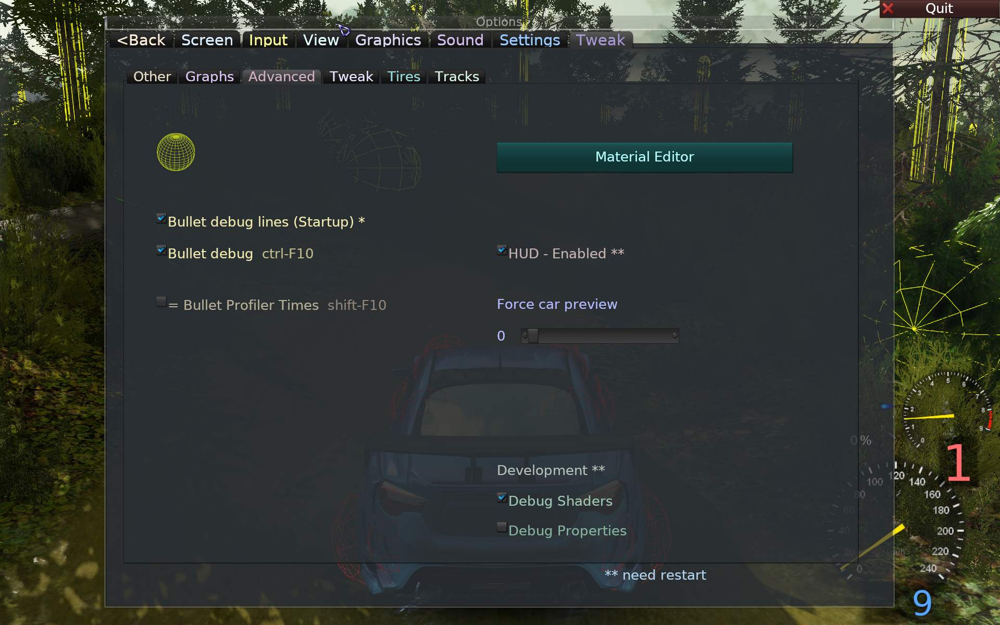
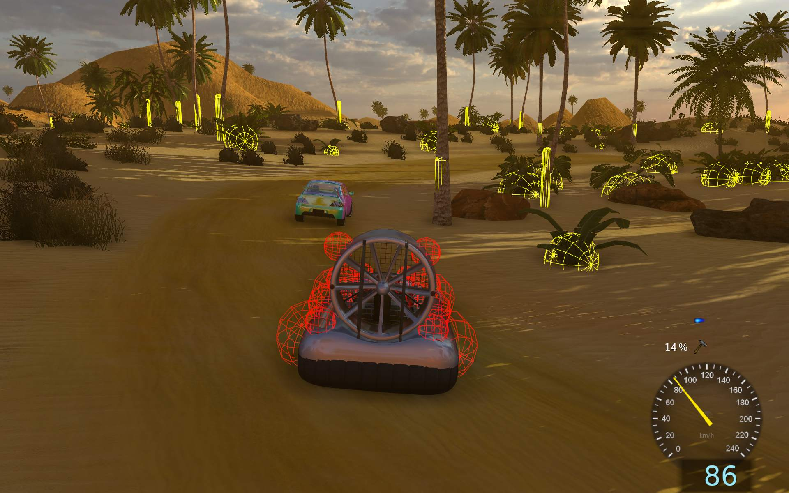
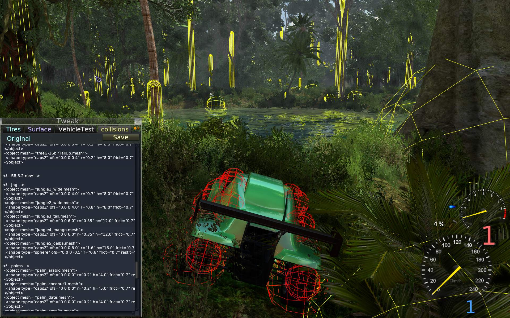
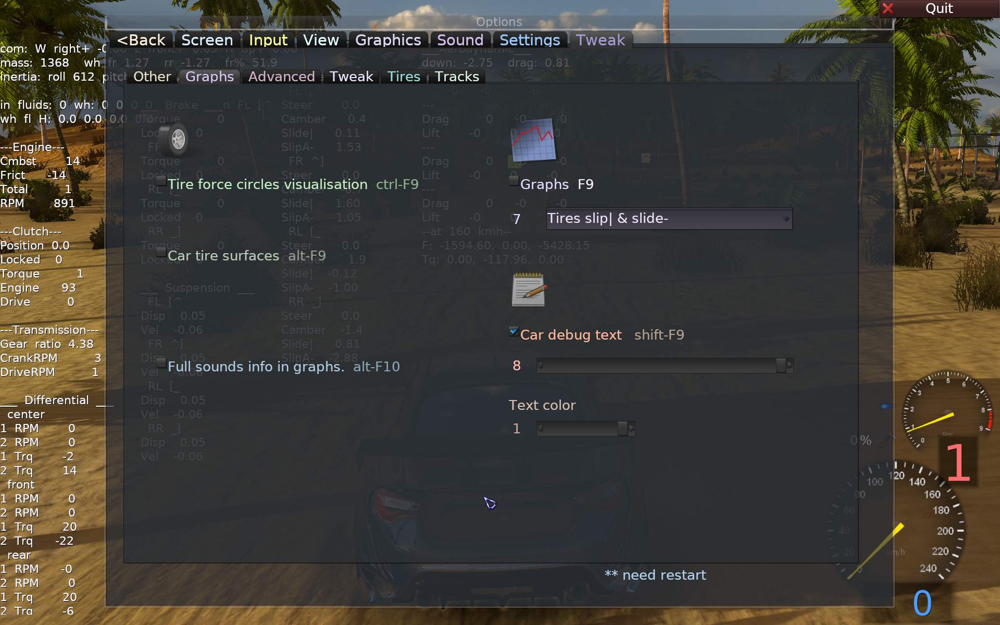
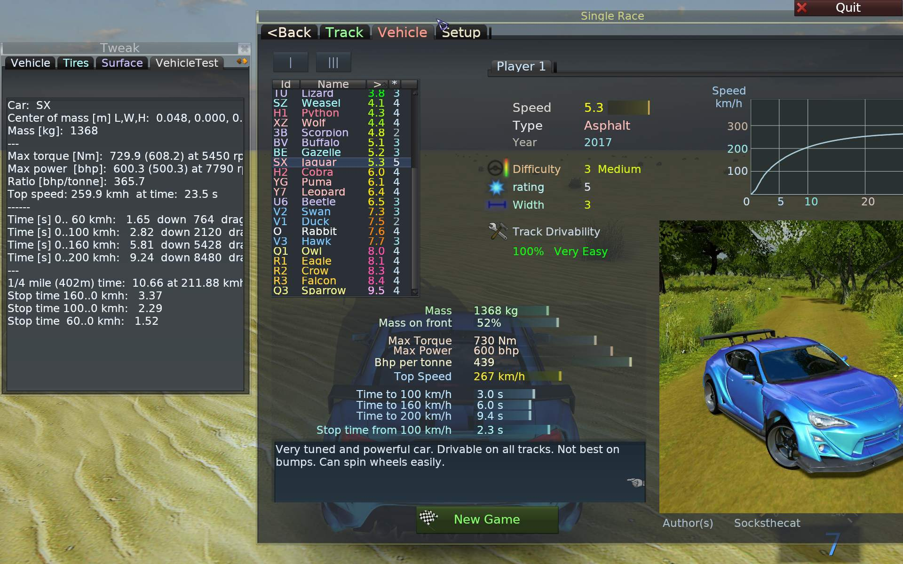

_Various tools and visualizations to tweak game._


## Tools list

This page describes most tools available in game (found on Tweak tab).   
How to use them and what are they for.   

They are listed here for quick guide:

| Shortcut | Tool name          | Description |
|----------|--------------------|-------------|
| Common:  |                    |             |
| F11      | 📈Fps bar          | Cycle Fps bar modes (left top). More info for values on Gui. First is always _Frames per second_. |
| F10      | 🌐Wireframe        | Changes rendering to wireframe lines. To see geometry detail and LOD swtiching. |
| Alt-F    | 🎨Material Editor  | Allows editing PBS material properties directly with sliders. Can save as json. |
|          |                    |             |
| Game:    |                    |             |
| Ctrl-F10 | 🎳Bullet Debug Lines | Show physics collision shapes🌐 as lines. |
| F9       | 📉Graphs           | Many types. Show detailed change of some values, life over time period. |
| Shift-F11| Profiler times text| Times [ms] it took each frame for components to update (render, physics). |
|          |                    |             |
| Shift-F9 | 🗒️Car debug Text   | Shows text values from simulation. |
| Alt-Z    | 🔩Vehicle Editor   | For editing .car file in game, Alt-Shift-Z will save changes and restart. |
| Alt-Z    | 🔧Other game tools | Other tabs have more tools: Tires, Surface and last: vegetation collisions.xml editor. |
| Ctrl-F5  | 🚗Performance Test | Starts vehicle performance test, results show eg. 0-100 km/h time etc. |

   
## Common

Available in game and in Track Editor.

### Fps bar

Cycle Fps bar mode with F11.  

This small left top bar shows values (that change, especially when moving), in default mode:
  - Rendered Frames per second (Fps), it's best to play with at least 30, 60 being optimal for most monitors.
  - Triangle count, e.g. 1.20 means there are 1 200 000 triangles drawn each frame (all render targets).
  - Batches count, e.g. 254 means there were 254 draw calls to render geometry on GPU.
  - GPU Memory use. e.g. 521M means 521 MB are occupied (by textures, geometry etc).

This is better explained on Gui for each mode, first tab inside Tweak tab.

### Wireframe

Toggle 🌐 wireframe mode with F10.  
_For everything, except Unlit: Gui, Hud, Particles._  
It is useful to check how dense are triangles in vehicle and wheel models (and also for whole track).

### Material Editor

More info on page [Materials](Materials.md#-material-editor).

   
----
## Game tools

Available only in game.
   
### Bullet Debug Lines

This is useful to check and adjust the shape of vehicle body that collides (convex from red spheres).  
To use bullet lines first check the global (Startup) option, and restart game.



   
If game was started with it enabled, you can toggle bullet debug lines with Ctrl-F10 or the next checkbox.



If you just need to edit vehicle collision, use test tracks which are usually quite empty (and also reload fast).  
Normal tracks can have a lot of vegetation and it will be horribly slow to draw all lines.

  
### Developer keys

If you mark the checkbox 'Developer keys..', also shown on previous screen (Tweak tab), you can:

1. Use Alt-Shift-digit/letter to quickly start a (test) track, without using menu.  
So e.g. Alt-Shift-A will load Test1-Flat, Alt-Shift-F loads Test3-Bumps, etc.  
Any tracks can now be picked for any digit/letter key from Gui combos on Tweak - Tracks tab.  
Or set in in `game.cfg` under `tweak_tracks` for each digit/letter key.

2. Press Ctrl-F at any time to show Gui and focus cursor in track search editbox.


----
   
### Vegetation collisions

As shown on previous screen, you can see yellow capsule shapes for trees trunk collision, bushes damping, etc.  
We use such simple shapes for trees.  
Rocks and objects have their *full* trimesh for collision,  
not shown (can be enabled in _cpp_ `/*| btCollisionObject::CF_DISABLE_VISUALIZE_OBJECT/**/`).  
Some are far too simple and don't fit though, they could use a simpler *collision mesh*. Loading track gets longer with detailed mesh.

Editing these vegetation collisions, can be done in game, or in file [collisions.xml](../data/models/collisions.xml).  
Tweak window tab collision has the file to edit and on save will create a user copy of it.

Open Tweak window and switch to collisions tab, to edit that file.   
Shift-Alt-Z will save your modifications, and restart game.   
See the top of this file for more info (e.g. how to disable collision or use full trimesh for model).

In `collisions.xml` each mesh `<object mesh` has a:  
`<shape` (or more) of type: "sphere", "capsZ" or "mesh", with few params set:  
- dimensions: `r` radius, `h` height (capsule), `ofs` offset (move position),
- `frict` friction, `restit` restitution, `damp` damping (for bush).  

Details in `BltObjects::LoadXml()`.

If a `.mesh` isn't in `collisions.xml`, it will have trimesh collison by default (rocks etc),  
if needed to avoid this there is a section on top `<none>` where you can add.  
But since all bush even have some damping shape, section is empty.




   
### Car file Editor

Editing vehicle settings (.car file) is done in game.
```
Alt-Z - toggles vehicle editor in game.
Alt-Shift-Z - saves changes and restarts game.
```
Use tracks Test1-Flat or Test2-Asphalt etc, to reduce reloading time and concentrate on editing vehicle.

_You can use your Text Editor (e.g. to have syntax coloring) and press F5 to reload game after saving .car file._

If the .car file for current vehicle wasn't modified, Editor will show cyan "Original" text and file path.   
After saving changes, yellow "User" path will appear.

Edited .car file is located in user dir path (see [Paths](Paths.md)) in `data/carsim/mode/cars/` subdir,  
where mode is current simulation mode (easy or normal).

   
### Graphs

Graphs in game can be used to test more advanced vehicle behaviour and simulation.

Press F9 to show/hide, F2,F3 will cycle through various graph types. Or use Gui to pick from combo.

E.g. engine torque curve can be seen, all gearbox ratios, suspension, etc.  
Those are explained in [VehicleEditing](VehicleEditing.md).


   
### Car debug Text

This was the first simulation visualisation and it is still useful if you want to check the values (if they don't change too fast).

Use this checkbox to toggle it or Shift-F9.

On Gui you can also change how many text sections are displayed and change text color to black or white.



   
### Performance test

Vehicle performance test is automatic. It's used to get performance info, which is shown on Gui, tab Vehicle.

Also useful to check this when editing vehicle (especially engine torque).

Press Ctrl-F5 to run test for current vehicle (it will load track "Test10-FlatPerf").

The car will accelerate to top speed and then brake. Simulation is speed up for this  
(to not wait long for results, factor in game.cfg section sim, perf_speed, use 1 for normal).  
_Need to quit game after to get it to normal.._

After it finishes it will show up results, and save them in user dir.  
This is in user path `/data/cars/ES/ES_stats.xml`.

Perf test stats contain info like max engine torque and power, top speed,  
acceleration times to 60, 100, 160, 200 km/h (with downforce and drag at those speeds)  
and brake time from 100, 60 to 0 km/h.

Most of those stats are then shown in info panel on Gui when when picking car in game.

_Run it for each sim mode (provided you made it different as game requires). See bottom of page for differences list._




   
## Game (advanced)

Surfaces and Tires are split to another page [TweakAdvanced](TweakAdvanced.md).
