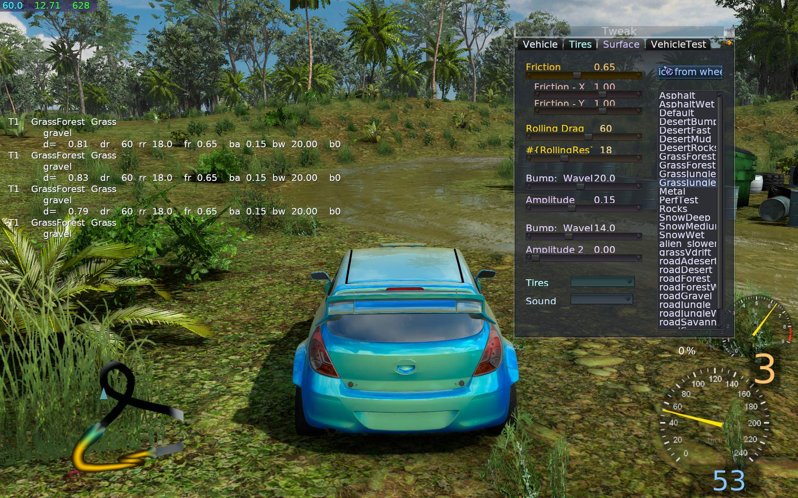
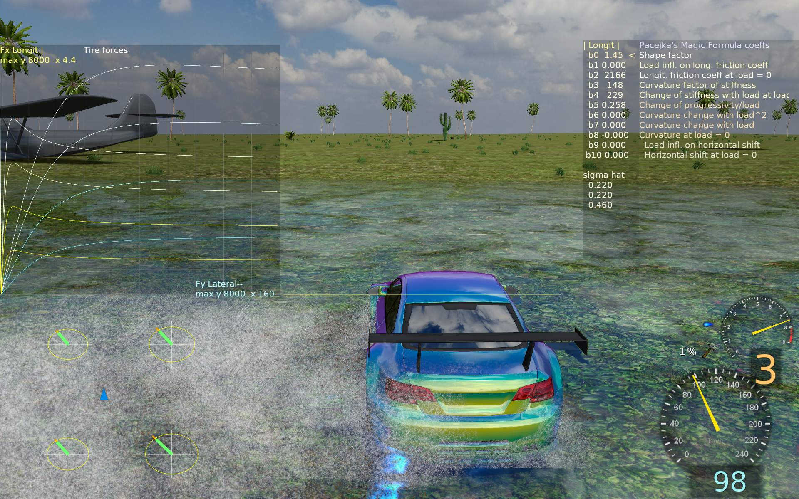
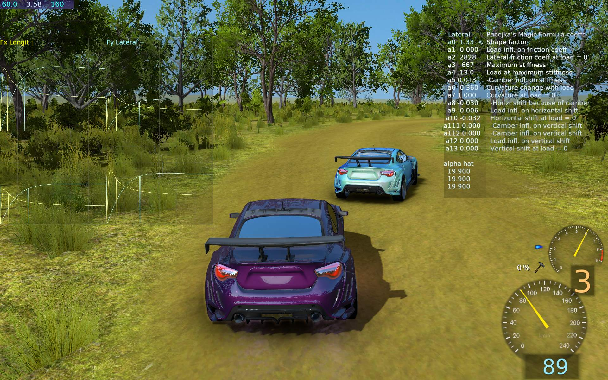

_Advanced game Tweak topics: Surfaces and Tires. At end a Links section for general info._  

## Game (advanced)
   
### Surfaces

Parameters are in surfaces.cfg.  
_ToDo: more info_

   
### Tires

**Tire editing** is possible in game during drive.  
This is a specific Graphs mode. On left showing resulting Tire Forces graphs (for 4 load forces).  
Graphs show both: longitudinal (Fx) force in yellow and lateral (Fy) in cyan colors.  

On right is the editor (list) with one set of parameters shown longitudinal or lateral (Home key toggle).  
This editor is a simple list of: parameter name, value and description.  
Using keys to move cursor `<` (PgUp, PgDn) and change selected value (Num /, Num *).  

There is more info on Tweak tab about keys and sliders for scale of Tire graphs scale, etc.  
Tires can be saved and loaded using Game Editor window (Alt-Z) on Tires tab.  

Left bottom also visible on screen are **Tire circles**. This visualization can be toggled.  
It shows each tire force in green (orange when exceeded in combine method),  
grip budget (force circle) an yellow circle (actually an ellipse), which size depends on wheel load force.  

Next screen shows all 4 wheels with dynamic tire graphs (Fx, Fy like before),  
but for actual load (and camber) given for each wheel.

#### Notes

Latest VDrift also has tire forces combining parameters (other set), and more tire models.  
But SR is based on VDrift sources from 2010, which did not have them yet.  
A lot was modified in SR and in VDrift, thus difficult to update.  

Tire editing is meant only for people with good knowledge of Pacejka's Magic Formula.  
And for those who want to tinker with it.

It can be very time consuming/wasting, and produce no better results.  
_Automatic testing for car handling would be better (like Perf test)._  

----
### Links

Useful links, videos, for futher study,  
with info on tire simulation, computations and general vehicle dynamics.  
_Some videos may not be that useful as title._  

#### Tires, docs

https://en.wikipedia.org/wiki/Tire_model
https://en.wikipedia.org/wiki/Hans_B._Pacejka#Magic_Formula_tire_models
https://en.wikipedia.org/wiki/Vehicle_dynamics
https://en.wikipedia.org/wiki/Slip_(vehicle_dynamics)
https://en.wikipedia.org/wiki/Self_aligning_torque

Racer info for **Pacejka**  
http://www.racer.nl/reference/pacejka.htm  
http://www.racer.nl/tutorial/combined_slip.htm  
http://www.racer.nl/reference/wheels.htm  

L 15 Expression on Magic Tire Formula  
https://www.youtube.com/watch?v=xJcvbE12K6A&list=PLQmc-I2-FO2GZaECA7S9VQXqEr_tDbg0s&index=16

**VDrift** Tire force combining review  
https://vdrift.net/Forum/showthread.php?tid=2207  
https://github.com/logzero/vdrift-tools  

Combined Slip Tire Models - Brush Tire Model and Pacejka Tire Model  
https://skill-lync.com/student-projects/l-208

#### Tire Circle

**Circle of friction**  
Your 'grip budget' - how do you drive it?  
https://www.youtube.com/watch?v=dZ33KJ1cl_c

Slip Angles - Tire Traction - Explained  
https://www.youtube.com/watch?v=9bs2cEyK7Uo

**In game**:  
How To Understand The Tuning Telemetry Window | Forza Horizon 5  
https://www.youtube.com/watch?v=PhPFS0M0ljU  
https://www.youtube.com/watch?v=74IcqCQFzjI  

The importance of tire slip  
https://www.youtube.com/watch?v=tsnYqCRWTbE

What is Slip angle ? | How lateral force is generated ? | What is self aligning moment ?  
https://www.youtube.com/watch?v=1k-sCL0SeRQ&list=PLEzzQIuBvBkoqJOP2IL3Elt6Ra8j4zFL3&index=16  

L 26 **Understeer and Oversteer** Effects on A Moving Vehicle  
https://www.youtube.com/watch?v=UmOHQycCH1E&list=PLQmc-I2-FO2GZaECA7S9VQXqEr_tDbg0s&index=27

Traction Circle - Explained
https://www.youtube.com/watch?v=JjCcFsGLpaM&list=PL2ir4svMoaYhu36bYSFHLstK7EFcSrO-k

Use Slip Angles to Corner Faster, Tires Explained
https://www.youtube.com/watch?v=3WaO4wPgZiA

#### Vehicle Dynamics

*Playlists:*  

https://www.youtube.com/playlist?list=PL2ir4svMoaYhu36bYSFHLstK7EFcSrO-k

https://www.youtube.com/playlist?list=PLQmc-I2-FO2GZaECA7S9VQXqEr_tDbg0s

https://www.youtube.com/playlist?list=PLEzzQIuBvBkoqJOP2IL3Elt6Ra8j4zFL3

#### Other

Conicity, Ply Steer, bikes  
How Lateral force is generated without cornering of tire ?  
https://www.youtube.com/watch?v=bMpYEB0V1As

IRL, How to set-up your Rally Car  
https://www.youtube.com/watch?v=zBvhR7EIZAM

How **temperature** and frequency effects the Tire behavior ?  
https://www.youtube.com/watch?v=qEG02Aj7vL0&list=PLEzzQIuBvBkoqJOP2IL3Elt6Ra8j4zFL3&index=12

Which Steering geometry you should use : Ackermann or Anti-Ackermann ?  
https://www.youtube.com/watch?v=BTcaIkbbrZY&list=PLEzzQIuBvBkoqJOP2IL3Elt6Ra8j4zFL3&index=20

#### Suspension

Vehicle Weight Transfer and Load Transfer  
https://www.youtube.com/watch?v=PHbw6dOev2I&list=PL2ir4svMoaYhu36bYSFHLstK7EFcSrO-k&index=19

Suspension Geometry - Part 1 (**Camber, Toe, Caster**, KPI, Scrub Radius)  
https://www.youtube.com/watch?v=VbReLNi2JP4

L 16 Fundamentals of Suspension System and Its Types  
https://www.youtube.com/watch?v=oKJfeFOsU08&list=PLQmc-I2-FO2GZaECA7S9VQXqEr_tDbg0s&index=17

Suspension - *playlist*  
https://www.youtube.com/playlist?list=PLE067A7397E1AF108
https://www.youtube.com/playlist?list=PL6R7zR4ZbGkNW6llAWSlskHu0hl_Cs82g

Solid Axle Suspension - How Truck Suspensions Work  
https://www.youtube.com/watch?v=mAiH776Ycyk&list=PLE067A7397E1AF108&index=13

How **Anti-Roll Bars** Work - How To Improve Car Handling  
https://www.youtube.com/watch?v=_liGnV3PTiQ&list=PLE067A7397E1AF108&index=14

#### Differentials

Understanding Limited Slip Differential  
https://www.youtube.com/watch?v=WeLm7wHvdxQ

#### Aerodynamics

L 3 Theory of Pressure Distribution on A Moving Car  
https://www.youtube.com/watch?v=lLt3q1WvPF8&list=PLQmc-I2-FO2GZaECA7S9VQXqEr_tDbg0s&index=3

L 5 Aerodynamic Aids to Reduce Overall Drag of A Car  
https://www.youtube.com/watch?v=5S3e6_kcqjE&list=PLQmc-I2-FO2GZaECA7S9VQXqEr_tDbg0s&index=5

How rear wing or spoiler of car works ? | How angle of attack effects the drag ?  
https://www.youtube.com/watch?v=qwu5Vz6zjnM

How front spoiler or Air dam works ? - Aerodynamics  
https://www.youtube.com/watch?v=Zat9o1uDdv0&list=PLEzzQIuBvBkoqJOP2IL3Elt6Ra8j4zFL3&index=24
