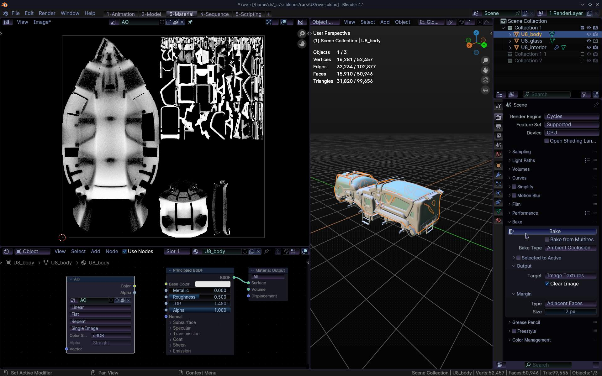
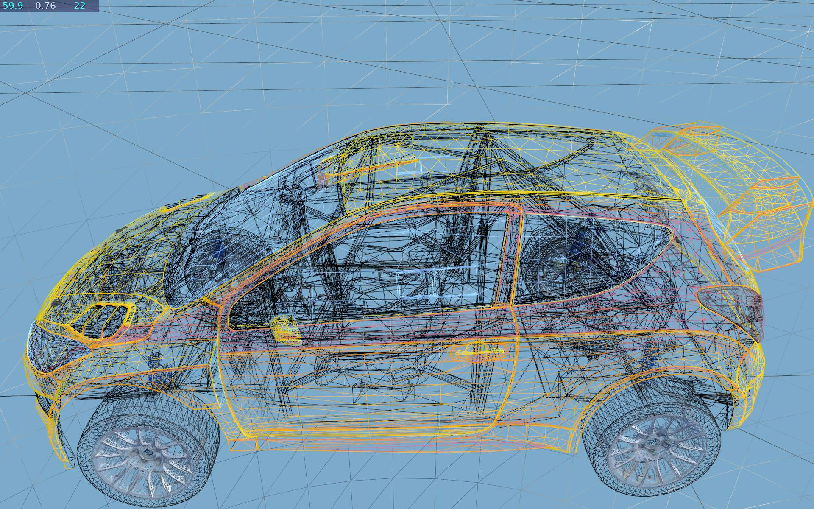
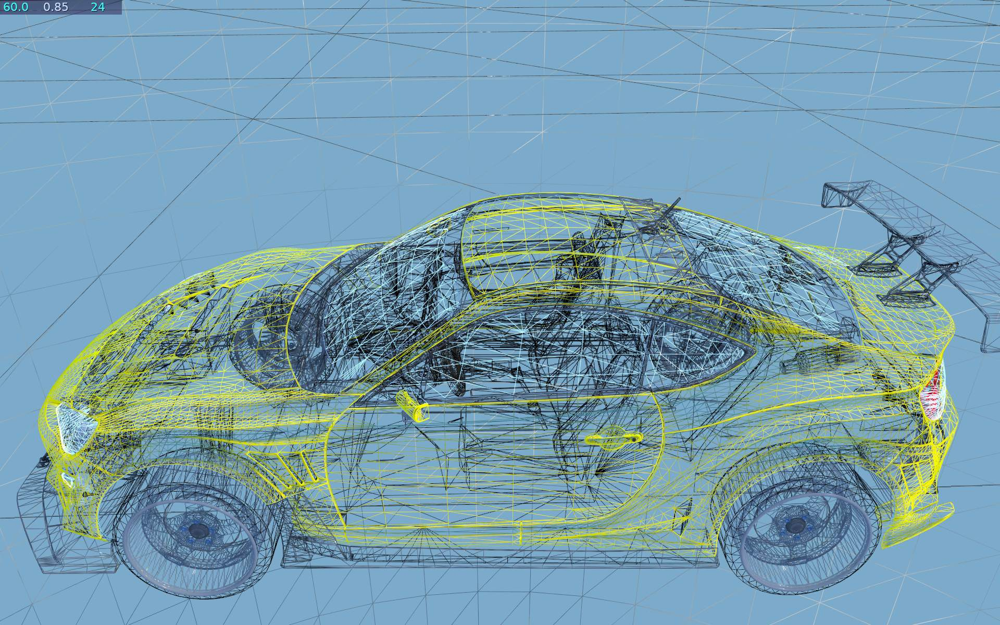
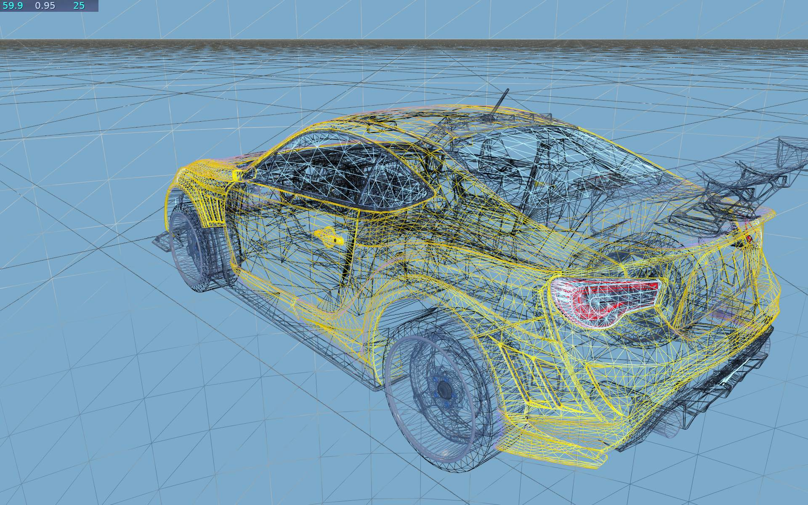
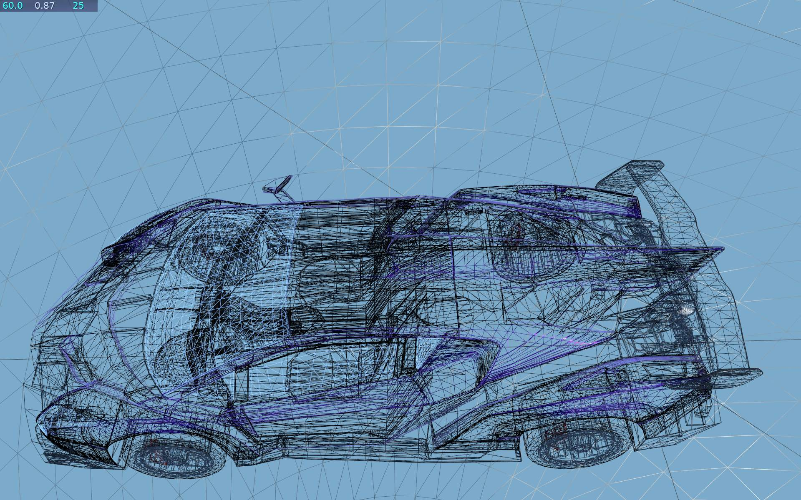

_Vehicle modeling tips and remarks._

## Modeling

To model a vehicle from start requires weeks of work and good knowledge of modeling techniques and how to do it.  
Modifying an existing vehicle (e.g. extending its quality) is much easier.  

### Model websites

There are already pretty good vehicle models, available on [sketchfab](https://sketchfab.com/search?category=cars-vehicles&features=downloadable&licenses=7c23a1ba438d4306920229c12afcb5f9&licenses=b9ddc40b93e34cdca1fc152f39b9f375&licenses=322a749bcfa841b29dff1e8a1bb74b0b&sort_by=-likeCount&type=models) or [blendswap](https://www.blendswap.com/blends/category/19).  

For info, see latest [vehicles](vehicles.md) with remarks.  
The list of wanted/accepted vehicles is [here](https://skfb.ly/oDrzD). It's already too many to handle.  

Some are too high poly or too low. And some just don't fit the game.  
The **license** for the art *must* be: CC0, CC-BY, CC-BY-SA or GPL, so we could use it.  
More info in [Objects](Objects.md) page.

Models sometimes still require some work (to have in game):
  * Lowering polygon count. No subdivisions. Decimate if necessary.
  * UV unwrap and mapping various vehicle 3d parts to 2d texture parts.
  * Making interior (if not present). Texturing.
  * Similarly, adding mesh triangles to cover any holes. We need all polygons single sided.
  * Baking AO maps (how to below). Models meant for rendering (not games) need these steps.

The more of these are needed to be done, the less likely a vehicle will be in SR.

## Blender

We are using and recommend [Blender](https://www.blender.org/) for all of the modeling tasks.  
At least basic knowledge of Blender is required.  
There are several good resources on internet to learn it:
  * [Blender Manual](https://docs.blender.org/manual/en/latest/).  
    Only few chapters are useful for us: Introduction, Modeling and Texturing/Unwrapping.
  * [Blender Tutorials](https://www.youtube.com/watch?v=ILqOWe3zAbk&list=PLa1F2ddGya_-UvuAqHAksYnB0qL9yWDO6&index=3) video playlist
  * other video [tutorial series](https://www.youtube.com/watch?v=RqfSkU-Hp1A&list=PL3GeP3YLZn5ixsnIOIx9tB4v6s-rsw48X&index=2)
  * Basically any common task in Blender is shown on some video (e.g. search youtube).  
    Keep in mind the version used should be close to yours and recent.
  * There are also video tutorials specifically on car/vehicle modeling.

### Blender keys

Various websites with Blender key shortcuts: [katsbits](https://www.katsbits.com/tutorials/blender/useful-keyboard-shortcuts.php), [keyxl](https://www.keyxl.com/aaac91e/403/Blender-keyboard-shortcuts.htm). Probably more or newer too.

### Shortcuts

Some main, quite useful **key shortcuts**:
- 1
  * Tab - toggle edit mesh mode,  Ctrl Space - zoom toggle
  * ` - quick change view,  T - toolbox,  N - transform, view details
  * Select: A - all,  B - rectangle,  C - circle,  Ctrl I - Invert
- 2
  * G - grab, Move,  S - Scale,  R - Rotate  
    * then can press X,Y,Z for axis, and type numerical values*
  * Ctrl A - Apply e.g. all transforms before export
  * H - Hide selected, Alt H - unhide all
- 3
  * U - Unwrap, with options
  * P - Separate (e.g. faces),  Ctrl J - Join meshes
  * Shift D - Duplicate*,  Ctrl M - Mirror*
- 4
  * Alt N - Normals (for e.g. Flip or Recalculate outside).
  * E - Extrude (e.g. edge or face),  K - Knife tool
  * F - add face(s) (needs at least 3 vertices or 2 edges selected)
  * M - Merge vertices
  * Subdivide (faces), Bevel (edges)

Useful modifiers:
  * Decimate - reduce if too high polygons (mesh triangles)
  * Subdivision surface - use if too low poly to smoothly add more poly
  * Edge split - use for hard edges, to separate normals
  * Mirror, Boolean, Array, Curve

   
----
## Model requirements

Things to keep in mind when modeling (required by game).

### Triangles count

Keep reasonable triangles count (faces, polygons). _Shortcut: tris._  
You can see it in top bar in Blender (turn on Statistics in viewport Overlays).  

For a very good looking vehicle for game, total of 50k to 150k triangles would be required (not counting wheels, k is 1000).  
Generally the less triangles a model has, the more detail has to be on textures.

One wheel (including brake disc and caliper) should be about 8k to 25k triangles.  
Bigger wheels with detail in mesh will have high tris counts.
[Comments](VehicleModeling.md#comments) section has more info.

More detail can (and should) be put in textures. More triangles will unnecessary reduce game Fps.

### Baking Maps

Ambient Occlusion (AO) is easy to bake and gives good feeling.  
*Very recommended* for all parts: body, interior, wheel.  
It may not be needed with SSAO effect, but almost a must without it.  

When generated from high poly model to low poly, baking Normal map is usually difficult and time consuming.  
It's not done, but great if already present with model.  
Thus next section describes how to do it on *same mesh*, much easier.  
Baking Normal map is not done, is usually difficult and can have errors, making it worse.  

### How to bake AO in Blender

Split View to add new of type: Shader Editor.  
_(not needed?) Switch it to: World and_  
from its menu: Add - Texture node - Image texture  
In new appeared block click button [+ New],  
name it e.g. AO, and set to 1024 size.  

On right in Render properties (camera icon) change engine to Cycles.  
now under Bake pane, set Bake Type to Ambient Occlusion  
set margin to 2 px (or more).  

Switch a view to UV Editor (or switch to UV Editing on top).  
From its menu Image click New, set size to 1024, name it e.g. AO2.  

Finally press Bake, back under Render properties.  
If you see any errors, make sure material has texture.  
Then rendering AO should start and appear on texture.  
After many seconds pass when it's done,  
click menu Image and Save as, to save AO texture for game.  

Screen after doing all above and baking body AO texture, for vehicle U8:



----
### Detail

Make as much detail as possible. For reference check out other vehicles from [our repo](https://github.com/stuntrally/blendfiles/tree/master/cars).  
HI and BE models are newest and best here, have lot of detail in textures. BE has even more, baked in normal map.  

To check geometry (triangles) just start game and press F10 to toggle wireframe.
Also game logs car meshes info in ogre.log (how to find it in [Paths wiki](Paths.md).  
Look for "MESH info: " it says how many submeshes (subs, materials) and how many triangles (tris) each part has and the total amounts.  
Most optimal and preferred is when there is 1 submesh and 1 material in each .mesh file.

#### Normals

Keep in mind that faces/polygons in Blender can be two sided, but in game are one sided.  
Thus the face normals (in blender) must be flipped to proper side. They won't be visible in game if on the other side.  
This sometimes requires to add more faces to cover holes now visible from other side.

#### Data Size

Vehicles (just like tracks) aren't big in size.  
ES is biggest and after export the Ogre, all .mesh files are about 1MB, and all textures 5MB.  
It's best to keep the size not too far from that (last highest are: 7 MB meshes and 19 MB textures).  
Usually bigger size for mesh will drop Fps in game anyway.  
And big textures could load longer and not really add detail from default camera, only closer.

#### Repositories

We have git repository with `.blend` files for most SR3 vehicles:  
https://github.com/stuntrally/blendfiles/tree/master/cars

Good example is the new HI model, was almost ready for game.  
SX is very good (right detail) outside, S8 too.  
But they had a simple UV unwrap. S8 interior was made and is very basic (like for many cars).  

   
----
### Parts (in Blender)

Note: replace ES with the in-game car name you work with.

Name the body parts (and the geometries): ES_body, ES_interior, ES_glass.

If you have a wheel then use: ES_wheel. ES_brake for brake disc and caliper (not necessary).

Car gets exported to such meshes:
  * ES_body - this is car body, only 1 material, covering the metal parts that will be colored in game using car color. Don't include any geometry here that doesn't have car paint on it in Blender.
  * ES_glass - this is car glass (windows) and also can have front or rear lights glass (makes lights look better).
  * ES_interior - has not only interior (seats and all inside car stuff) but also front/rear lights, exhaust pipe, car bottom, rubber (dark) parts between car metal and so on. Simply all model parts that don't get colored by car paint.
  * ES_wheel - car wheel rim (metal) and car tire, may also have brake disc. It is best to use 1 material, and put parts in different places (UV) of texture.
  * ES_brake - (optional)

This makes the exported files already named properly for game, so just copying there works.

_(We use such short names, simply because it is not possible to use original car names)._

This Blender screenshot shows (for XZ car):
  - 3D view of interior faces
  - joined geometry parts with good names
  - material names, still too many
  - UV editor with unwrapped faces to texture  
  (note this is a work in progress, only interior and car bottom are mapped properly, rest is mostly garbage, not done yet)


A finished interior with good UV map would look similar to this (for ES car):


Exporting models from Blender to Ogre (see [Objects](Objects.md#preparations) Wiki on how to install exporter) is done from menu File|Export|Ogre3D.

From the exporter options pick axes as "xz-y", use tangents (mark checked), uncheck edges-list (we don't need them).


If successful, you will find files in the selected folder (1 mesh file in xml format and 1 binary mesh fie) for each selected geometry in blender.

Copy the binary .mesh files (parts) into the data/cars/ES dir in Stunt Rally (replacing the older/original ones).

Start Stunt Rally and check how it looks.


### Materials

Name all materials in Blender with car prefix, e.g. ES_body, ES_glass, ES_interior, ES_wheel, etc.

Keep the material count at minimum. This is crucial.

We can't have each car part like front/rear lamps, seats, steering wheel etc as separate parts, they must be on 1 mesh (geometry) and have UV mapped to different parts of texture.

It is best to have each body part with 1 material, with the same name as geometry (ES_interior, ES_glass etc).

_(Each material represents new batch (draw call) and parameter changes which reduces game Fps)._

So, join (Ctrl-J) all geometry in interior. Mark seams on edges that will get cut. Unwrap (U) parts.

Use UV editor to move and scale parts to according places on texture. Don't make parts overlap on texture.

Use bigger scale for parts that require more texturing (detail).

In game we can use:
  * diffuse map - to add texture to objects, change color, etc. This is required, but it can be simple 1 color at start.
  * specular map - if parts have different shininess (color in rgb and power in alpha), e.g. this is obvious for wheel rim (shiny) and tire (matte), still can be on 1 texture which is more optimal (more Fps).
  * reflection map - to mark shiny parts with environment reflection (eg. glass, rim), or deny reflections (tire)

   
----
## Data (in game)

Desired file structure in data/cars/3S (for (already exported) old car 3S).

### main dir, meshes

3S_body.mesh  
3S_interior.mesh  
3S_glass.mesh  
3S_wheel.mesh  
3S_brake.mesh

Those files were already described.

### main dir, other files

about.txt - Contains info of the model, license, credits, changes, etc.  

Info text displayed in game about the vehicle and how it handles in game is in  
main translations file: [*_en_tag.xml file](../data/gui/core_language_en_tag.xml) under:  
```
	<!--  Game Vehicle descriptions  -->
	<Tag name="CarDesc_OT">This is the slowest car. Very old and a bit creepy truck. Can drive only on flat tracks and with turtle speed.</Tag>
```

### textures subdir

3S_body00_red.png - Main body texture. It has to be colored in saturated red, because it will change depending on car paint chosen in game. Can just be whole red texture at start of car creation.

Old, *not used*:  
3S_body00_add.png - Old version cars used this to add detail to red texture. Can be full transparent at start.  
3S_body00_brake.png - Same as add but with rear brakes lit. The texture add was replaced to brake when car brake is on.

3S_interior.png - interior texture (with various car parts mapped too) possibly with 3S_interior_normal.jpg.  
3S_glass.png - the transparent glass texture (usually small)

optional: 3S_spec.png, 3S_refl.png - to map specular parts and reflection, or deny them on matte parts.

3S_Tire.png, 3S_Tire_norm.png - diffuse and normal texture for tire model


### Materials file

More details in [Materials](Materials.md) page.  
Materials for *all* vehicles are defined in [vehicle.material.json](../data/materials/Pbs/vehicle.material.json).

As an example for HI, you can see its materials:  
- `HI_0` - for body (1st car, `HI_0`..`HI_5` for all 6 player cars and `HI_G` for ghost), colored by paint  
- `HI_glass` - glass mesh
- `HI_interior` - interior and/or exterior mesh(es), not colored
- `HI_wheel` - wheel mesh


----
## Comments

This sections shows some good examples of vehicles with some comments on their model.  
No model is perfect, and every one has some smaller or bigger issues.  
I describe some here, with what could be done to improve.

Surely artist(s) who could improve vehicles would be welcome.  

The ALL (total) counts are computed as sum of body, interior, glass and 4 times wheel and brake.

Usually models meant for PBS have even big 4k textures and more than we need.  

ES was made with interior and dashboard, so good it could actually be used for in-car camera view.

Lines in wireframe should be dense for body. Usually round details like lamps get much denser.  
Also interior would require much detail both in geometry and textures.  
But we're lucky if we even get an interior. Many models were made just for rendering from outside.


### HI

Recent HI model was well made and almost ready for game.  
Only one with even engine mesh under hood, also had a driver.  
Many cool details in interior. Some got low res. even on 2k texture.

```
HI_body.mesh	 sub: 1  tri: 73.6k
HI_interior.mesh	 sub: 1  tri: 52.6k
HI_glass.mesh	 sub: 1  tri:  5.3k
HI_wheel.mesh	 sub: 1  tri: 25.7k
HI	 ALL sub: 7  tri: 234.3k
```



### SX

New recent model. Quite *a lot* of tris in total, but I think it is great.  
Body parts could be decimated more, but I didn't want to degrade smoothness.  
Likely with many cars (>10) we'd need LODs to not affect/drop Fps.

It was unfinished, untextured, no wheels, etc.  
Thus texturing and materials were done simply and are meh,  
not great for interior and exterior parts, as usual.

```
SX_body.mesh	 sub: 1  tri: 81.9k
SX_interior.mesh	 sub: 2  tri: 113.8k
SX_glass.mesh	 sub: 1  tri:  8.3k
SX_wheel.mesh	 sub: 1  tri: 26.3k
SX_wheel.mesh	 sub: 1  tri: 26.3k
SX	 ALL sub: 8  tri: 309.2k
```





### S8

S8 has good, high tris counts, but not much detail in textures.  
Hard to improve, has to be made by an experienced artist.

```
S8_body.mesh	 sub: 1  tri: 43.0k
S8_interior.mesh sub: 2  tri: 81.1k
S8_glass.mesh	 sub: 1  tri: 16.6k
S8_wheel.mesh	 sub: 1  tri:  3.9k
S8_brake.mesh	 sub: 1  tri:  3.1k
S8	 ALL sub: 12  tri: 168.9k
```


### YG

Good, well made model. Not too big tris count.  
*Submeshes* count is rather high (ALL sub: 15).  
It's because a wheel uses 2 *materials* (sub: 2).  
Oddly rim texture was put inside body texture, and wheel tire has own.  
Also there is brake mesh present.  
Thus (2+1)*4 = 12 draws needed for 4 wheels.  
Not an issue since auto HW instancing is used. _And Fps with OgreNext doesn't suffer from this like with Ogre._

```
YG_body.mesh	 sub: 1  tri: 75.3k
YG_interior.mesh	 sub: 1  tri: 50.3k
YG_glass.mesh	 sub: 1  tri:  2.5k
YG_wheel_front.mesh	 sub: 2  tri: 14.9k
YG_wheel_rear.mesh	 sub: 2  tri: 14.9k
YG_brake.mesh	 sub: 1  tri:  1.4k
YG	 ALL sub: 15  tri: 193.3k
```

### Y7

Complex car model, not too decimated, thus *big* tris count.  
Not a big problem (not far from YG), even it if could be made with less tris.

```
Y7_body.mesh	 sub: 1  tri: 77.6k
Y7_interior.mesh	 sub: 1  tri: 124.8k
Y7_glass.mesh	 sub: 1  tri:  5.2k
Y7_wheel_front.mesh	 sub: 1  tri: 11.2k
Y7_brake.mesh	 sub: 1  tri:  0.3k
Y7	 ALL sub: 11  tri: 253.6k
```



### XZ

This car has very smooth body, but nowadays with too low tris count.

*Interior* was made by me and thus is rather poor.  
I copied seats from S8, and made the rest of interior by extruding 1 line and adjusting it. It has also poor texturing there.  
But still it's an interior and better than none (the original model didn't have it).

Next thing is that the body has *holes*. They are visible from close.  
It is needed to add triangles to interior which would be dark and would cover those holes.  
Interior also has holes, near mirrors, when seen from inside car. Need to add more interior faces there.  
This happens because faces are 1 sided in game. When adding the second, interior faces, keep some distance,  
because if it's too low, shadows are blinking on those parts.

Wheel rim has many tris, but I left it since too much decimation can produce unwanted distortion in mesh.

```
XZ_body.mesh	 sub: 1  tri: 22.0k
XZ_interior.mesh sub: 1  tri: 20.1k
XZ_glass.mesh	 sub: 1  tri:  1.0k
XZ_wheel.mesh	 sub: 1  tri: 11.8k
XZ_brake.mesh	 sub: 1  tri:  0.3k
XZ	 ALL sub: 11  tri: 91.8k
```

